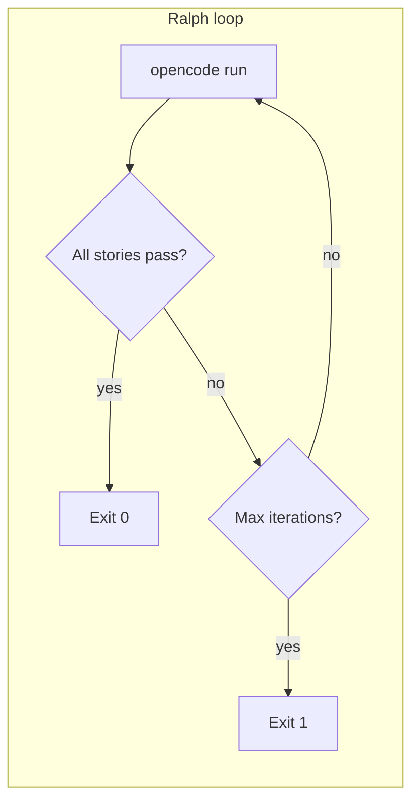

# Open Ralph Loop

**Open Ralph Loop** is a small **bash driver** that runs **[OpenCode](https://opencode.ai/)** in a **Ralph-style loop**: the model works through a **product backlog** stored in your repo, **one user story per iteration**, until every story is marked done or a **maximum iteration count** is reached.

It is inspired by the [Ralph](https://github.com/snarktank/ralph) pattern and tailored for **OpenCode**.

**It uses the default model (local, self-hosted or commercial) configured in Opencode, unless you override it with the RALPH_MODEL environment variable, to run the tasks, then you must configure Opencode properly before run Ralph.**

---

## What it does

1. **Pre-flight** (optional but recommended): talks to your model server’s OpenAI-compatible API (`GET …/v1/models`) to read `max_model_len` and **cap completion tokens** so prompts + tools + output stay inside context (important for ~32k windows).
2. **Loop**: for each iteration, runs `opencode run` with your **Ralph agent** and a **prompt** that instructs the model to read `.ralph/prd.json`, pick the next story, implement it, run checks, commit, and update progress.
3. **Stops** when all stories in the PRD have `passes: true`, or when **max iterations** is hit.

OpenCode’s working directory is always the **repository root**. Ralph-specific files live under **`.ralph/`** (leading dot).



---

## Prerequisites

| Requirement | Notes |
|-------------|--------|
| **[OpenCode](https://opencode.ai/)** | `opencode` on `PATH` |
| **`jq`** | Parse `.ralph/prd.json` |
| **`curl`** | Pre-flight against vLLM / OpenAI-compatible APIs |
| **A model** | Configured in OpenCode (e.g. vLLM in `.opencode/opencode.json`) |

---

## Quick start

1. **Clone or copy** this template into a project you want to automate (or use this repo as-is).

2. **Configure OpenCode** so `opencode run` can reach your provider (see your project’s `.opencode/opencode.json` or global config).

3. **Ralph environment** (optional but typical):

   ```bash
   cp .ralph/.env.example.minimal .ralph/.env
   # Edit .ralph/.env — at minimum set VLLM_API_KEY if your server needs it
   ```

   Full list of variables: **`.ralph/.env.example`**.

4. **Product backlog**:

   ```bash
   cp .ralph/prd.json.example .ralph/prd.json
   # Edit user stories, branch name, priorities
   ```

5. **Run the loop** from the **repository root**:

   ```bash
   ./ralph.sh          # default: 10 iterations
   ./ralph.sh 25       # up to 25 iterations
   ```

   On first run, `.ralph/progress.txt` is created if missing. Example PRD and prompt text ship under `.ralph/`; adjust them to match your product.

---

## Key files

| Path | Role |
|------|------|
| **`ralph.sh`** | Wrapper; calls `.ralph/ralph.sh` |
| **`.ralph/ralph.sh`** | Loop, pre-flight, progress rotation |
| **`.ralph/.env`** | Secrets and `RALPH_*` / `OPENCODE_*` (not committed; use `.env.example` as reference) |
| **`.ralph/prd.json`** | User stories, `passes`, `branchName`, priorities |
| **`.ralph/progress.txt`** | Story log, iteration log, codebase patterns |
| **`.ralph/prompt.md`** | Per-run **task** text (loop workflow, paths, stop condition) |
| **`.opencode/agents/ralph.md`** | **Agent** definition: tools, mode, and stable OpenCode instructions |

The prompt file is passed as the **message** to each `opencode run`; the agent file configures **how** OpenCode runs (tools, context discipline). Set `RALPH_PROMPT_FILE` in `.ralph/.env` if you use a different prompt path.

---

## Configuration tips

- **Tight context (vLLM ~32k):** pre-flight sets a completion budget from `max_model_len`; tune **`RALPH_MAX_OUTPUT_TOKENS`**, **`RALPH_COMPLETION_HARD_CAP`**, and **`RALPH_MIN_CTX`** in `.ralph/.env` if you hit length errors.
- **Cannot reach vLLM from the shell** (e.g. WSL networking): set **`RALPH_VLLM_URL`** to a base URL that **`curl` can reach**, matching OpenCode’s server.
- **Tool calling:** vLLM should use real **`tool_calls`**; for Qwen on vLLM, prefer **Instruct** (non-Coder) checkpoints and **`--enable-auto-tool-choice`** / **`--tool-call-parser hermes`** as described in `.ralph/.env.example`.

---

## Inspiration & license

- Pattern: [snarktank/ralph](https://github.com/snarktank/ralph)  
- License: see [LICENSE](LICENSE).
